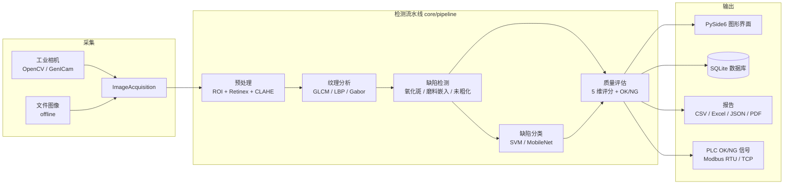
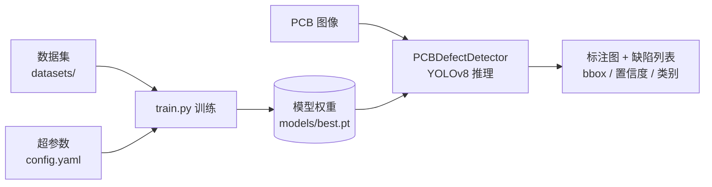

# PCB 阻焊前喷砂质量在线检测系统

基于 **经典计算机视觉（OpenCV + 纹理分析）** 与 **深度学习（YOLOv8）** 的 PCB（印制电路板）质量检测系统。系统面向 PCB 阻焊前喷砂工艺，对喷砂后的铜面进行在线质量评估，并支持对 PCB 裸板进行 6 类缺陷的自动检测与训练。

---

## 项目概览

本项目包含两套相互补充的检测子系统：

| 子系统 | 技术路线 | 入口 | 说明 |
| ------ | -------- | ---- | ---- |
| **喷砂质量在线检测** | 经典 CV + 机器学习（GLCM / LBP / Gabor + SVM） | `main.py` | 对喷砂后铜面进行预处理、纹理分析、缺陷检测与多维度质量评分，提供 GUI 与 CLI 两种模式 |
| **PCB 缺陷检测（YOLOv8）** | 深度学习目标检测 | `train.py` / `utils/detector.py` | 基于 YOLOv8 检测 6 类 PCB 缺陷，支持训练与推理 |

---

## 功能特性

### 喷砂质量检测（`main.py`）

- **图像预处理**：ROI 铜面提取、多尺度 Retinex 光照校正、CLAHE 对比度增强
- **纹理特征提取**：GLCM（灰度共生矩阵）、LBP（局部二值模式）、Gabor 滤波器组
- **缺陷检测**：氧化斑/污渍、磨料嵌入、未粗化区域 3 类喷砂缺陷
- **质量评估**：粗糙度均匀性、锚纹方向一致性、氧化斑面积比、磨料嵌入计数、未粗化面积比 5 维评分，输出 OK/NG 判定
- **缺陷分类**：SVM（手工特征，无需 GPU）与 MobileNetV3（深度学习，可选）
- **硬件集成**：工业相机（OpenCV / GenICam）、PLC 通信（Modbus RTU / TCP）
- **图形界面**：多标签页（检测 / 参数 / 统计 / 历史）、热力图、实时评分、相机预览、配置热更新
- **数据持久化**：SQLite / SQLAlchemy 存储，支持 CSV / Excel / JSON 导出

### PCB 缺陷检测（YOLOv8）

- 6 类缺陷目标检测：`missing_hole`、`mouse_bite`、`open_circuit`、`short`、`spur`、`spurious_copper`
- 推理前可选 CLAHE 对比度增强（针对低对比度 PCB 图像）
- 支持 CPU / CUDA 推理与训练，自动设备解析
- 合成 PCB 缺陷样本生成（含标注）

---

## 系统架构

### 喷砂质量检测流水线



### PCB 缺陷检测（YOLOv8）



---

## 目录结构

```
.
├── main.py                  # 喷砂质量检测系统入口（GUI + CLI）
├── train.py                 # YOLOv8 训练脚本
├── config/
│   └── default.yaml         # 喷砂检测系统统一配置
├── config.yaml              # YOLOv8 检测/训练配置
├── data.yaml                # YOLOv8 数据集定义
├── core/                    # 核心算法模块
│   ├── preprocessing.py     # 预处理（ROI + Retinex + CLAHE）
│   ├── texture.py           # 纹理特征（GLCM / LBP / Gabor）
│   ├── defects.py           # 缺陷检测（氧化斑 / 磨料嵌入 / 未粗化）
│   ├── classifier.py        # 缺陷分类（SVM / MobileNet）
│   ├── quality.py           # 质量评估与 OK/NG 判定
│   ├── pipeline.py          # 主检测流水线
│   ├── acquisition.py       # 图像采集（文件 / 相机）
│   └── reporter.py          # 检测报告生成
├── ui/                      # PySide6 图形界面
├── hardware/                # 硬件接口（相机 / PLC）
├── data/                    # 数据持久化（数据库 / 导出）与样例图像
├── utils/                   # 工具模块
│   ├── detector.py          # YOLOv8 PCB 缺陷检测器
│   ├── preprocess.py        # 图像预处理工具（CLAHE / 去噪 / 缩放）
│   ├── patches.py           # PyTorch 2.6+ 兼容性补丁
│   └── validators.py        # 输入校验
├── scripts/                 # 数据生成 / 分析 / 训练脚本
├── tests/                   # 单元测试
├── models/                  # 模型权重
├── datasets/                # YOLOv8 数据集
└── PCB_defect_detection/    # YOLOv8 训练输出（已 gitignore）
```

---

## 环境要求与安装

- Python 3.10+
- 推荐使用虚拟环境

```bash
# 1. 创建虚拟环境
python -m venv .venv

# 2. 激活虚拟环境（按平台选择）
#    Windows (cmd)
.venv\Scripts\activate.bat
#    Windows (PowerShell)
.venv\Scripts\Activate.ps1
#    Linux / macOS
source .venv/bin/activate

# 3. 确认激活成功（命令行提示符前出现 (.venv)）
python --version

# 4. 安装基础依赖
pip install -r requirements.txt
```

> **PowerShell 提示**：若执行 `Activate.ps1` 报「禁止运行脚本」，先执行
> `Set-ExecutionPolicy -Scope Process RemoteSigned` 再激活。

### 可选依赖

| 功能 | 安装命令 | 说明 |
| ---- | -------- | ---- |
| PyTorch（MobileNet 分类器 / YOLOv8） | 见 `requirements.txt` 顶部注释 | 根据 GPU 配置选择 CPU / CUDA 版本 |
| YOLOv8 | `pip install ultralytics` | PCB 缺陷检测与训练 |
| PLC 通信 | `pip install pymodbus` | Modbus RTU / TCP |
| PDF 报告 | `pip install fpdf2` | PDF 检测报告导出 |

> **提示**：YOLOv8 在 PyTorch 2.6+ 下需通过 `utils/patches.py` 兼容补丁加载模型，相关脚本已在入口处自动应用。

---

## 快速开始

### 1. 喷砂质量检测 — GUI 模式

```bash
python main.py                          # 使用默认配置启动图形界面
python main.py --config config/custom.yaml   # 使用自定义配置
```

### 2. 喷砂质量检测 — CLI 模式（单张图像）

```bash
python main.py --cli data/samples/board_01_simple.jpg
```

输出检测评分、缺陷列表、预警信息，并在 `results/` 目录保存标注结果图。

### 3. PCB 缺陷检测 — YOLOv8 推理

```python
from utils.detector import PCBDefectDetector

detector = PCBDefectDetector("config.yaml")      # 自动加载 models/best.pt
image, detections = detector.detect("path/to/pcb.jpg", preprocess=True)

for d in detections:
    print(d["class_name"], d["confidence"], d["bbox"])
```

### 4. PCB 缺陷检测 — YOLOv8 训练

```bash
python train.py                 # 超参数在 config.yaml 中配置
```

数据集定义见 `data.yaml`，训练输出保存在 `PCB_defect_detection/yolov8n_pcb/`。

---

## 配置说明

### 喷砂检测系统（`config/default.yaml`）

- **`system`**：运行模式（online/offline）、图像目录、相机编号、触发模式、分辨率、板尺寸
- **`inspection.roi`**：铜面 ROI 提取（HSV 阈值）
- **`inspection.preprocessing`**：Retinex、CLAHE 参数
- **`inspection.texture`**：GLCM / LBP / Gabor 参数
- **`inspection.defects`**：氧化斑、磨料嵌入、未粗化检测阈值
- **`inspection.classifier`**：分类器类型（svm/mobilenet）、模型路径、置信度阈值
- **`inspection.quality`**：质量评估阈值与 OK/NG 判定分数线
- **`output`**：结果保存、数据库连接、日志级别
- **`plc`**：Modbus 协议、端口、信号地址
- **`camera`**：相机驱动、分辨率、曝光、增益、触发源
- **`data_processing`**：滑动平均窗口、连续 NG 预警、SPC 控制限

> 配置支持实时重载，检测模块在每次运行前读取最新值。

### YOLOv8 检测/训练（`config.yaml`）

- **`model_path`**：模型权重路径（默认 `models/best.pt`）
- **`device`**：`auto` / `cpu` / `cuda` / `0`
- **`class_names`**：缺陷类别（需与训练数据顺序一致）
- **`confidence_threshold`** / **`input_size`**：推理参数
- **`training`**：训练超参数（预训练权重、epochs、imgsz、batch、lr0、早停等）

---

## 缺陷类型

### 喷砂工艺缺陷（经典 CV 检测）

| 类型 | 检测方法 |
| ---- | -------- |
| 氧化斑 / 污渍（oxidation） | HSV 颜色空间分割 + 连通域分析 |
| 磨料嵌入（abrasive_embedding） | 形态学白顶帽变换（White Top-hat） |
| 未粗化区域（unroughened） | GLCM 纹理能量阈值分割 |

### PCB 裸板缺陷（YOLOv8 检测）

`missing_hole`（漏孔）、`mouse_bite`（鼠咬）、`open_circuit`（开路）、`short`（短路）、`spur`（毛刺）、`spurious_copper`（残铜）。

---

## 数据与脚本

| 脚本 | 用途 |
| ---- | ---- |
| `scripts/generate_sandblasted_samples.py` | 生成喷砂铜面合成样本（含锚纹与可注入缺陷） |
| `scripts/generate_samples.py` | 生成带标注的 6 类 PCB 缺陷合成图像 |
| `scripts/train_classifier.py` | 训练缺陷分类器（SVM / MobileNet） |
| `scripts/process_analysis.py` | 喷砂参数—表面质量—阻焊附着力关联分析 |

样例图像与标注位于 `data/samples/`。

---

## 运行测试

```bash
pytest
```

单元测试覆盖预处理（`test_preprocessing.py`）、纹理特征提取（`test_texture.py`）、缺陷检测（`test_defects.py`）、缺陷分类（`test_classifier.py`）。

---

## 许可证

本项目仅供学习与工业检测研究使用。
