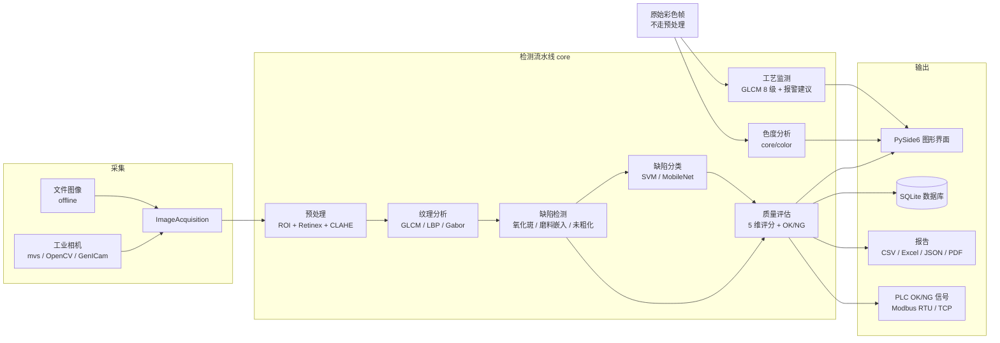
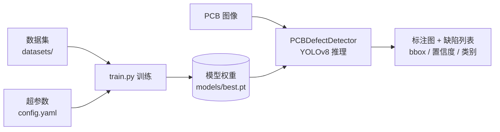

# PCB 阻焊前喷砂质量在线检测系统

基于 **经典计算机视觉（OpenCV + 纹理分析）** 与 **深度学习（YOLOv8）** 的 PCB（印制电路板）质量检测系统。系统面向 PCB 阻焊前喷砂工艺，对喷砂后的铜面进行在线质量评估，并支持对 PCB 裸板进行 6 类缺陷的自动检测与训练。

---

## 项目概览

本项目包含两套相互补充的检测子系统：

| 子系统 | 技术路线 | 入口 | 说明 |
| ------ | -------- | ---- | ---- |
| **喷砂质量在线检测** | 经典 CV + 机器学习（GLCM / LBP / Gabor + SVM） | `main.py` | 对喷砂后铜面进行预处理、纹理分析、缺陷检测与多维度质量评分，提供 GUI 与 CLI 两种模式 |
| **PCB 缺陷检测（YOLOv8）** | 深度学习目标检测 | `train.py` / `utils/detector.py` | 基于 YOLOv8 检测 6 类 PCB 缺陷，支持训练与推理 |

> ⚠ **本项目的配置阈值大多尚未用现场数据标定**，属占位值。上机前务必先读
> [已知限制与待标定项](#已知限制与待标定项)。

---

## 功能特性

### 喷砂质量检测（`main.py`）

- **图像预处理**：ROI 铜面提取、多尺度 Retinex 光照校正、CLAHE 对比度增强
- **纹理特征提取**：GLCM（灰度共生矩阵）、LBP（局部二值模式）、Gabor 滤波器组
- **缺陷检测**：氧化斑/污渍、磨料嵌入、未粗化区域 3 类喷砂缺陷
- **质量评估**：粗糙度均匀性、锚纹方向一致性、氧化斑面积比、磨料嵌入计数、未粗化面积比 **5 维加权评分**，输出 OK/NG 判定
- **色度 / 饱和度指标**（第 6 项）：补氧化面积法的结构性盲区——均匀薄氧化膜不产生连通域、面积比接近 0 会被判良品。色相偏移 ΔH 与饱和度下降 ΔS 是全局面统计量，对均匀变色敏感。**只监测、只导出，不进总分、不影响 OK/NG**
- **工艺参数监测**：GLCM 8 级量化纹理特征 → 阈值报警 + 面向操作工的工艺调节建议（提高/降低喷砂速度）
- **缺陷分类**：SVM（手工特征，无需 GPU）与 MobileNetV3（深度学习，可选）
- **硬件集成**：工业相机（海康官方 SDK / OpenCV / 通用 GenICam 三条驱动路线）、PLC 通信（Modbus RTU / TCP）
- **图形界面**：检测结果 / 热力图 / 统计三个标签页（统计内含合格率趋势、缺陷分布、质量雷达图），另带实时分析数据面板、相机设置与参数配置对话框、配置热更新
- **数据持久化**：SQLite / SQLAlchemy 存储，支持 CSV / Excel / JSON / PDF 导出

### PCB 缺陷检测（YOLOv8）

- 6 类缺陷目标检测：`missing_hole`、`mouse_bite`、`open_circuit`、`short`、`spur`、`spurious_copper`
- 推理前可选 CLAHE 对比度增强（针对低对比度 PCB 图像）
- 支持 CPU / CUDA 推理与训练，自动设备解析
- 合成 PCB 缺陷样本生成（含标注）

---

## 系统架构

### 喷砂质量检测流水线



> **色度分析为什么绕开预处理**：`Preprocessor` 会灰度化 / Retinex 校正，色彩量
> 一旦经过这条链就不可恢复。因此它在采集路径上直接吃**原始彩色帧**
> （`core/color.py` 的 C1 条）。

### PCB 缺陷检测（YOLOv8）



---

## 目录结构

```
.
├── main.py                  # 喷砂质量检测系统入口（GUI + CLI）
├── train.py                 # YOLOv8 训练脚本
├── config/
│   └── default.yaml         # 喷砂检测系统统一配置
├── config.yaml              # YOLOv8 检测/训练配置
├── data.yaml                # YOLOv8 数据集定义
├── core/                    # 核心算法模块
│   ├── preprocessing.py     # 预处理（ROI + Retinex + CLAHE）
│   ├── texture.py           # 纹理特征（GLCM 256 级 / LBP / Gabor）
│   ├── process_monitor.py   # 工艺监测（GLCM 8 级 + 报警与工艺建议）
│   ├── color.py             # 色度 / 饱和度指标（只监测，不进总分）
│   ├── defects.py           # 缺陷检测（氧化斑 / 磨料嵌入 / 未粗化）
│   ├── classifier.py        # 缺陷分类（SVM / MobileNet）
│   ├── quality.py           # 质量评估与 OK/NG 判定
│   ├── pipeline.py          # 主检测流水线
│   ├── acquisition.py       # 图像采集（文件 / 相机）
│   └── reporter.py          # 检测报告生成
├── ui/                      # PySide6 图形界面
│   ├── main_window.py       # 主窗口与标签页组装
│   ├── stats_panel.py       # 统计面板（趋势 / 分布 / 雷达图）
│   ├── process_panel.py     # 实时分析数据面板（工艺判定 + 维护建议）
│   ├── heatmap_widget.py    # 粗糙度 CV 热力图
│   ├── camera_dialog.py     # 相机设置对话框（含设备扫描 / 测试连接）
│   ├── camera_worker.py     # 相机采集线程
│   ├── config_dialog.py     # 参数配置对话框
│   ├── image_viewer.py      # 图像显示与缩放
│   ├── mpl_font.py          # matplotlib 中文字体配置
│   └── workers.py           # 后台检测线程
├── hardware/                # 硬件接口
│   ├── camera.py            # 相机抽象基类 + OpenCV / GenICam 驱动
│   ├── mvs_camera.py        # 海康 MV 系列官方 SDK 驱动（默认）
│   └── plc.py               # PLC 通信（Modbus RTU / TCP）
├── data/                    # 数据持久化（数据库 / 导出）与样例图像
├── utils/                   # 工具模块
│   ├── detector.py          # YOLOv8 PCB 缺陷检测器
│   ├── preprocess.py        # 图像预处理工具（CLAHE / 去噪 / 缩放）
│   ├── patches.py           # PyTorch 2.6+ 兼容性补丁
│   └── validators.py        # 输入校验
├── scripts/                 # 数据生成 / 分析 / 训练脚本
├── tools/
│   └── check_camera.py      # 相机连通性诊断（不开 GUI，逐项排查）
├── tests/                   # 测试套件（22 个测试文件）
├── docs/                    # 测试报告与标定清单
├── models/                  # 模型权重
├── datasets/                # YOLOv8 数据集
└── PCB_defect_detection/    # YOLOv8 训练输出（已 gitignore）
```

---

## 环境要求与安装

- Python 3.10+（开发环境为 3.12）
- 推荐使用虚拟环境

```bash
# 1. 创建虚拟环境
python -m venv .venv

# 2. 激活虚拟环境（按平台选择）
#    Windows (cmd)
.venv\Scripts\activate.bat
#    Windows (PowerShell)
.venv\Scripts\Activate.ps1
#    Linux / macOS
source .venv/bin/activate

# 3. 确认激活成功（命令行提示符前出现 (.venv)）
python --version

# 4. 安装基础依赖
pip install -r requirements.txt
```

> **PowerShell 提示**：若执行 `Activate.ps1` 报「禁止运行脚本」，先执行
> `Set-ExecutionPolicy -Scope Process RemoteSigned` 再激活。

### 可选依赖

| 功能 | 安装命令 | 说明 |
| ---- | -------- | ---- |
| PyTorch（MobileNet 分类器 / YOLOv8） | 见 `requirements.txt` 顶部注释 | 根据 GPU 配置选择 CPU / CUDA 版本 |
| YOLOv8 | `pip install ultralytics` | PCB 缺陷检测与训练 |
| PLC 通信 | `pip install pymodbus` | Modbus RTU / TCP |
| PDF 报告 | `pip install fpdf2` | PDF 检测报告导出 |
| 海康相机 | 安装 MVS 安装包（勾选 SDK / 开发组件） | 提供 `MvCameraControl.dll`，`mvs` 驱动依赖它 |

> **提示**：YOLOv8 在 PyTorch 2.6+ 下需通过 `utils/patches.py` 兼容补丁加载模型，相关脚本已在入口处自动应用。

---

## 快速开始

### 1. 喷砂质量检测 — GUI 模式

```bash
python main.py                          # 使用默认配置启动图形界面
python main.py --config config/custom.yaml   # 使用自定义配置
```

### 2. 喷砂质量检测 — CLI 模式（单张图像）

```bash
python main.py --cli data/samples/board_01_simple.jpg
```

输出检测评分、缺陷列表、预警信息，并在 `results/` 目录保存标注结果图。

### 3. 相机连通性诊断

出问题先跑这个——不开 GUI，从「MVS 装没装」一路查到「能不能取到一帧图」，每步失败都给可操作的中文提示：

```bash
python tools/check_camera.py                  # 默认走海康官方 SDK
python tools/check_camera.py --list-only      # 只枚举设备，不打开
python tools/check_camera.py --driver opencv  # 检查 OpenCV 相机
```

### 4. PCB 缺陷检测 — YOLOv8 推理

```python
from utils.detector import PCBDefectDetector

detector = PCBDefectDetector("config.yaml")      # 自动加载 models/best.pt
image, detections = detector.detect("path/to/pcb.jpg", preprocess=True)

for d in detections:
    print(d["class_name"], d["confidence"], d["bbox"])
```

### 5. PCB 缺陷检测 — YOLOv8 训练

```bash
python train.py                 # 超参数在 config.yaml 中配置
```

数据集定义见 `data.yaml`，训练输出保存在 `PCB_defect_detection/yolov8n_pcb/`。

---

## 配置说明

### 喷砂检测系统（`config/default.yaml`）

- **`system`**：运行模式（online/offline）、图像目录、空间分辨率、板尺寸
- **`inspection.roi`**：铜面 ROI 提取（HSV 阈值）
- **`inspection.preprocessing`**：Retinex、CLAHE 参数
- **`inspection.texture`**：GLCM / LBP / Gabor 参数（256 级量化口径）
- **`inspection.defects`**：氧化斑、磨料嵌入、未粗化检测阈值
- **`inspection.classifier`**：分类器类型（svm/mobilenet）、模型路径、置信度阈值
- **`inspection.quality`**：质量评估阈值与 OK/NG 判定分数线
- **`inspection.process_monitor`**：工艺监测阈值（GLCM **8 级**量化口径）与建议文案模板
- **`inspection.color`**：色度 / 饱和度指标的绝对与自适应阈值、通道顺序
- **`output`**：结果保存、数据库连接、日志级别
- **`plc`**：Modbus 协议、端口、信号地址
- **`camera`**：相机驱动（`mvs` / `opencv` / `harvesters`）、分辨率、像素格式、曝光、增益、设备绑定、触发源
- **`data_processing`**：滑动平均窗口、连续 NG 预警、SPC 控制限

> 配置支持实时重载，检测模块在每次运行前读取最新值。

> **相机编号与触发模式只在 `camera` 节里配**（`camera.device.index` / `camera.trigger`），
> `system` 节不再保留同名项——两处配置同一件事只会互相打架。

> ⚠ **`inspection.color.color_order` 必须与喂进来的字节顺序一致**。这个量无法从
> 数组形状推断（BGR 与 RGB 都是三通道），喂错**不报错**，只会静默把色相转掉 172°。
> GUI / CLI 入口已做 BGR→RGB，故默认 `rgb`；从采集器直接取帧的路径显式传 `bgr`。

### YOLOv8 检测/训练（`config.yaml`）

- **`model_path`**：模型权重路径（默认 `models/best.pt`）
- **`device`**：`auto` / `cpu` / `cuda` / `0`
- **`class_names`**：缺陷类别（需与训练数据顺序一致）
- **`confidence_threshold`** / **`input_size`**：推理参数
- **`training`**：训练超参数（预训练权重、epochs、imgsz、batch、lr0、早停等）

---

## 缺陷类型

### 喷砂工艺缺陷（经典 CV 检测）

| 类型 | 检测方法 |
| ---- | -------- |
| 氧化斑 / 污渍（oxidation） | HSV 颜色空间分割 + 连通域分析 |
| 磨料嵌入（abrasive_embedding） | 形态学白顶帽变换（White Top-hat） |
| 未粗化区域（unroughened） | GLCM 纹理能量阈值分割 |

### 色度 / 饱和度（`core/color.py`，只监测）

不属缺陷，是**全局面统计量**，补上面面积法的盲区。输出色相圆均值 / 圆标准差、
饱和度分位数，以及越界区域的连通域定位（几处、多大、在哪）。

| 判据 | 抓什么 |
| ---- | ------ |
| 绝对阈值 | 整板均匀变色（面积法的结构性盲区） |
| 自适应阈值 | 局部异常：油污 / 水渍 / 指纹（灰度特征弱、色彩特征强） |

两者**互相独立**，同时命中时各出一条区域记录，不合并。

### PCB 裸板缺陷（YOLOv8 检测）

`missing_hole`（漏孔）、`mouse_bite`（鼠咬）、`open_circuit`（开路）、`short`（短路）、`spur`（毛刺）、`spurious_copper`（残铜）。

---

## 数据与脚本

| 脚本 | 用途 |
| ---- | ---- |
| `scripts/generate_sandblasted_samples.py` | 生成喷砂铜面合成样本（含锚纹与可注入缺陷） |
| `scripts/generate_samples.py` | 生成带标注的 6 类 PCB 缺陷合成图像 |
| `scripts/train_classifier.py` | 训练缺陷分类器（SVM / MobileNet） |
| `scripts/process_analysis.py` | 喷砂参数—表面质量—阻焊附着力关联分析 |
| `tools/check_camera.py` | 相机连通性诊断 |

样例图像与标注位于 `data/samples/`（**合成图**，仅供功能演示与回归测试，不能用于标定）。

---

## 运行测试

```bash
pytest                                   # 全量（pytest.ini 已默认开启覆盖率）
pytest -m "not hardware"                 # 排除需要真实相机 / PLC 的用例
pytest tests/test_color.py -v            # 单个文件
pytest -p no:cacheprovider --no-cov      # 关掉覆盖率，快很多
```

覆盖率报告自动生成：终端打印缺行号，HTML 在 `results/coverage/index.html`。

### 当前基线

```
1318 passed, 2 skipped, 33 xfailed
覆盖率：core + hardware + ui + utils 合计 77%，其中非 UI 部分 90%
```

具体数值随硬件可用性浮动——带 `hardware` 标记的用例在没接相机 / PLC 的机器上会 skip，
所以换个环境数字会对不上，**以通过/失败为准，别把数字当验收标准**。

### 关于 33 个 xfail

它们**不是「预期会失败的功能」**，而是**已核实的缺陷台账**：每条都带 `reason=`
说明缺陷位置与现象，例如

```
XFAIL tests/test_mvs_camera.py::TestOpen::test_open_returns_false_when_sdk_unavailable
  - 缺陷：hardware/mvs_camera.py:266-270 的 _ensure_sdk 失败分支只 print 不写 last_error……
```

修好之后应当**去掉 xfail 标记**，而不是留着——留着会让它变成永远不会红的空测试。
清单见 `docs/2026-09-17-企业级测试报告.md`。

### 写测试的两条约定

1. **覆盖率不等于质量。** 断言不到实处的测试能把数字刷上去，但永远不可能失败。
   新增测试后建议做一次**故障注入**：把被测的那行改坏，确认它真的会红。
2. **离屏跑 GUI 测试**：`os.environ.setdefault("QT_QPA_PLATFORM", "offscreen")`
   + `pytest.importorskip("PySide6.QtWidgets")`，参见 `tests/test_camera_dialog.py`。

---

## 已知限制与待标定项

### 一、阈值几乎全部未标定

`config/default.yaml` 里带 `⚠` 或「临时标定值」注释的项，都是按合成样本或单张
测试图凑出来的，**没有一条经过现场良品/不良品分布验证**。直接上机得出的 OK/NG
结论不可信，而且**不会报任何错**。上机前按下面这份清单逐项重标：

> **[`docs/2026-09-20-彩色相机待标定项清单.md`](docs/2026-09-20-彩色相机待标定项清单.md)**
>
> 换彩色相机后尤其要注意——相机、镜头、光源是一个整体，换掉任何一环，
> 标定值全部作废。清单里最关键的一条：`inspection.color.absolute` 的基准色相
> 来自一张**合成图**，不是现场样本的统计量。

### 二、色度指标不进总分

刻意的设计：`weights` 五项精确加和 1.0，加维度必然重排权重、改动既有样本总分，
属于必须重回标定的动作。所以第一版只监测、只展示、只导出，不影响 OK/NG。
等拿到现场彩色样本分布、定了阈值，再考虑是否并入总分。

### 三、两套 GLCM 口径并存

`core/texture.py`（256 级量化，供缺陷检测/SVM）与 `core/process_monitor.py`
（8 级量化，供工艺报警）**不能互相换用阈值**——两套口径的 contrast 相差 1~2 个
数量级，换用会导致永远报警或永远不报警。两处模块 docstring 里都写明了。

### 四、通道顺序在旧路径上不自洽

`Preprocessor` / `DefectDetector` 按 **BGR** 解释输入，`ProcessMonitor` 按 **RGB**；
而 GUI/CLI 入口喂 RGB、`process_acquisition` 喂 BGR——**两条路径各有一半是错的**。
`core/preprocessing.py` 内部也不自洽（灰度化一行按 BGR、Retinex 分支按 RGB）。

已由 `tests/test_color_contract.py` 用表征测试把**现状**钉住（防止有人「顺手统一」
时无人察觉），**属待修缺陷，不是期望行为**。新模块 `core/color.py` 不受影响，
它自带走显式的 `color_order` 参数。

### 五、数据库尚未接入检测流程

`data/models.py` 与 `data/database.py` 已完整实现并带 schema 迁移，但**检测流程里
没有「写库」这一步**——GUI 跑完检测不会落库。当前只支持导出报表。

---

## 许可证

本项目仅供学习与工业检测研究使用。
